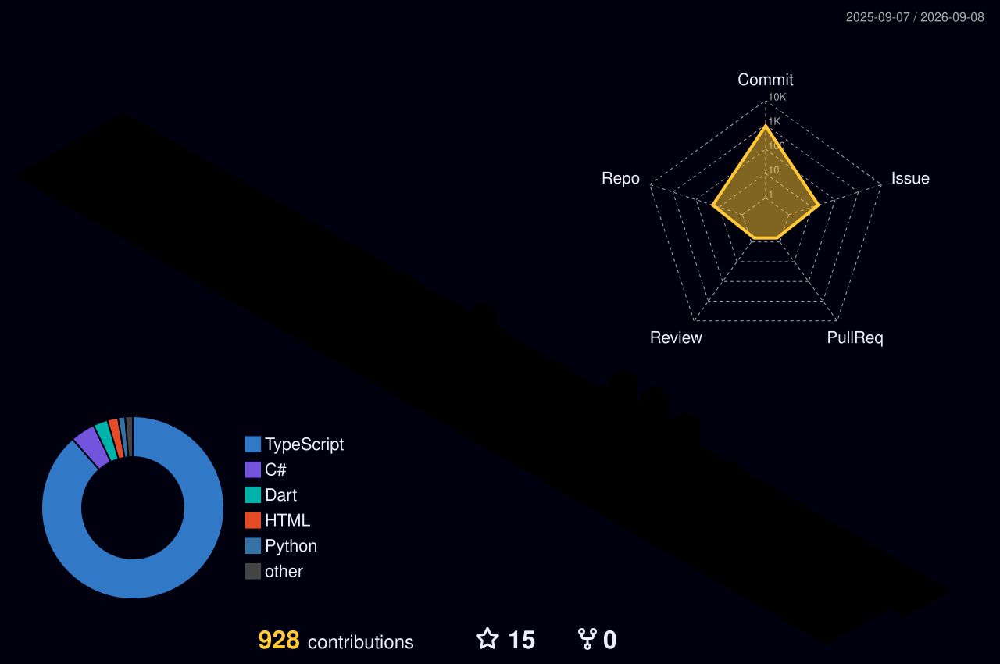

  
# Hi! I'm Christopher 
### Full Stack Developer | 2nd Year CS Student | Mobile Dev Specialist

---

## 🏗️ Current Project: ResPi

The main project I am focusing on right now is our final school project which is going to be a 100% working and deployment-ready app called **ResPi**.

Its main focus is providing our local sports-club with an app for users to make reservation of various courts of the respective sports club. The app will provide a management account and interface for the administration group to fully control the app such as a client side interface to make the process of reservations less of a headache.
### Infrastructure:
- **☁️ Cloud:** Our system is deployed in a VPS which has its own domain and is secured.
- **⚙️ Backend:** NestJS with MariaDB → [Project Repo](https://github.com/Christopher-Blc/ProyectoApp_Acceso_A_Datos.git)
- **📱 Mobile:** React Native → [Project Repo](https://github.com/Christopher-Blc/Respi_Frontend.git)

---

  
## 🛠️ My Tech Toolbox
  
### 💻 Backend & ERP

  
### 📱 Mobile & Frontend

  
### 🗄️ Infrastructure & Tools

---
## 📊 GitHub Stats & Activity

  
  

   
  

  

  

---

  
### 📫 Let's Connect
[LinkedIn](https://www.linkedin.com/in/christopher-bolocan-98038b221?utm_source=share_via&utm_content=profile&utm_medium=member_ios) | [Email](mailto:chris.bolocan@gmail.com) 

